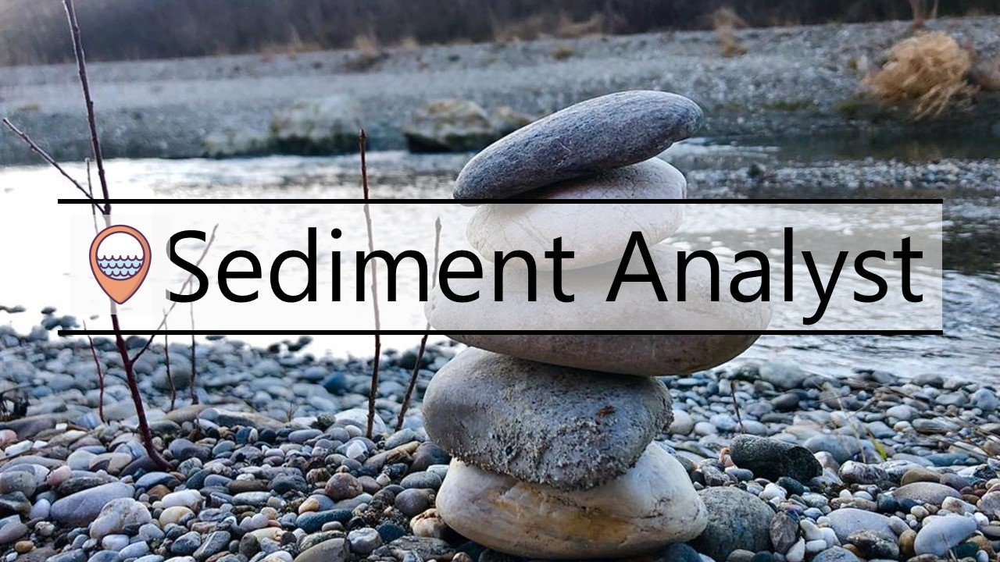

# Sediment Analyst


## Welcome

Sediment Analyst is a modularized Python package and dash app that enables sedimentological analyses. By using sieving datasets as input, Sediment Analyst computes sediment statistics. For a complete list of computed statistics see section below (*Outputs*). For using our app, please watch our video tutorial [here](https://youtu.be/zXfN9-M12i0).


## Requirements

Python > 3.0 is required, but Python 3.9 is preferable due to stable behaviors in regard to the packages.

The used *Python* libraries are: *numpy*, *scipy*, *pathlib*, *matplotlib*, *openpyxl*, *pandas*, *seaborn*, *dash*, *pyproj*, *plotly*.

Standard libraries include: *re*, *locale*, *logging*, *glob*, *sys*, *os*, *math*

Important! Checkout the ```requirements.txt``` file for the version requirements of the packages.


## Running the Codes and preparing Inputs

The input data for sediment-analyst consists of Excel/csv files for each sediment sample. Accepted extensions are therefore ```.csv``` and ```.xlsx```. 

Use Sediment Analyst locally by cloning this repository or online with our app. Checkout:

### Clone the repository

    $ git clone https://github.com/beatriznegreiros/sediment-analyst

For running the code in your computer, clone this repository and make sure to install the necessary packages (checkout the ```requirements.txt``` file). Change the input parameters in the ```config.py``` and run ```main.py``` in the subpackage *analyzer*. 

Please note that the plots provided in the *analyzer* subpackage are static (not interactive plots). These may be useful for reports and single sediment sample analyses. 


Sediment Analyst features a novel app for enabling interactive analyses. The app can be hosted locally if you run  ```web_application.py``` in the *app* subpackage. 
Click on the link provided by your console (the link is similar to http://000.0.0.0:0000/). We provide a full video [tutorial](https://youtu.be/zXfN9-M12i0) on how 
you can correctly input where the index information is, so that Sediment Analyst can parse your data files, in case you are not using our template as input file. **Optional inputs** for the app are: latitude and longitude, SF (sphericity index) and Porosity index.

### Use the app

The app can be also accessed [here](https://sedimentanalyst.herokuapp.com), which runs with a [heroku](https://www.heroku.com/) server. Note that here there is a maximum limit of 500 MB when loading in the app. For inputting very large datasets (> 500 MB) we recommend using the app locally. 

[](https://sedimentanalyst.herokuapp.com/)


## Outputs and Capabilities

Sediment Analyst computes the following:
* A summary of sediment characteristics, which can be exported as csv:
    * d10, d16, d25, d30, d50, d84, d90.
    * Mean grain size, geometric mean grain size [(Bunte and Abt, 2001)](https://onlinelibrary.wiley.com/doi/abs/10.1111/j.1752-1688.2001.tb05528.x), grain size standard deviation, geometric standard deviation [(Frings et al., 2011)](https://agupubs.onlinelibrary.wiley.com/doi/full/10.1029/2010WR009690).
    * Sorting index, Fredle index.
    * Skewness and kurtosis.
    * Coefficient of uniformity, curvature coefficient.
    * Porosity estimators according to empirical equations available in the literature:
        * [Carling and Reader (1982)](https://onlinelibrary.wiley.com/doi/abs/10.1002/esp.3290070407)
        * [Wu and Wang (2006)](https://ascelibrary.org/doi/full/10.1061/%28ASCE%290733-9429%282006%29132%3A8%28858%29)
        * [Wooster et al. (2008)](https://agupubs.onlinelibrary.wiley.com/doi/full/10.1029/2006WR005815): recommended for gravel-beds with geometric standard deviation between 0.004 m and 0.018 m.
        * [Frings et al. (2011)](https://agupubs.onlinelibrary.wiley.com/doi/full/10.1029/2010WR009690)
    * Hydraulic conductivity estimators computed with the [Kozeny-Carman Equation](https://link.springer.com/content/pdf/10.1007%2F978-3-642-40872-4_1995-1.pdf). Hydraulic Conductivity (kf) is computed in m/s with each of the above-mentioned computed porosity values.
    * Cumulative percentages according to the [Wentworth scale](https://www.planetary.org/space-images/wentworth-1922-grain-size).
 * Cumulative grain size distribution curves, which are available as:
    * Static plots per sample with the *analyzer* subpackage.
    * Interactive plots with user-selected samples using the *app* subpackage.
 * Only in the app:
    * Bar chart of statistics.
    * Interactive map listing sample information (optional, is generated when latitude (y) and longitude (x) values are available).
 
 *For more information see the documentation of the class StatisticalAnalyzer.*


## Package Structure
Sediment Analyst is structured in two Python subpackagess: *analyzer* and *app*. The app subpackage imports the *analyzer* subpackage for computing sediment statistics and for using utils.


## Code Documentation

Access the [readthedocs](https://sedimentanalyst-sediment-analyst.readthedocs-hosted.com/en/latest/#) for checking the code documentation. We recommend, however, the usage of our video [tutorial](https://youtu.be/zXfN9-M12i0) for the app.


